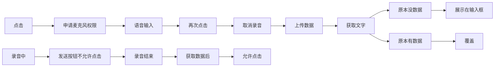

### ai-chat 语音识别功能

### 操作链路



## 方案选择

| **特性**     | **MediaRecorder API**                            | **recorderJS**                        | **Pocketsphinx.js**                                                  |
| :--------- | :----------------------------------------------- | :------------------------------------ | :------------------------------------------------------------------- |
| **核心功能**   | 浏览器原生录音功能，支持音频/视频录制，导出为 `Blob`（WebM/MP4）。        | 基于 Web Audio API 的音频录制库，支持导出为 WAV 格式。 | 语音识别 + 录音功能，支持实时语音转文字（ASR），基于 WebAssembly/JavaScript 实现。             |
| **依赖**     | 无需第三方库，浏览器原生支持。                                  | 依赖 Web Audio API，需引入 recorderJS 库文件。  | 依赖 WebAssembly（通过 Emscripten 编译）和 JavaScript，需引入 pocketsphinx.js 文件。 |
| **支持格式**   | 音频：WebM（Opus 编码）；视频：WebM/MP4（VP8/VP9/H.264 编码）。  | WAV 格式（无压缩）。                          | 录音输出为原始音频数据，语音识别支持文本输出。                                              |
| **性能**     | 轻量级，适合快速录音；但复杂处理（如 MP3 编码）需额外库（如 LameJS）。        | 轻量级，适合基础录音；音频处理能力有限。                  | 基于 WebAssembly，性能较高，但语音识别模型较大，需较多内存和计算资源。                            |
| **兼容性**    | 现代浏览器（Chrome/Firefox/Edge/Safari）均支持，但移动端兼容性需测试。 | 依赖 Web Audio API，现代浏览器兼容性较好。          | 主要支持 Chrome 和 Firefox，WebAssembly 支持需较新浏览器版本。                        |
| **语音识别能力** | **无**，仅提供录音功能。                                   | **无**，仅提供录音功能。                        | **支持**，内置语音识别引擎（PocketSphinx），支持多语言模型（如中文）。                          |
| **音频处理**   | 支持基础录制，但需结合其他库（如 LameJS）进行压缩或格式转换。               | 支持基础录音和导出 WAV，可扩展处理（如剪辑、特效）。          | 仅支持录音，语音识别为独立流程。                                                     |
| **适用场景**   | 快速实现录音并保存为文件（如语音备忘录、会议记录）。                       | 需要简单录音功能，且需导出 WAV 格式（如在线课程、语音评论）。     | 需要实时语音识别（如智能助手、在线教育口述评估）或离线语音转文字的场景。                                 |
| **代码复杂度**  | 简单，原生 API 调用即可实现。                                | 简单，API 易用，适合快速集成。                     | 中等，需配置语言模型和声学模型，代码复杂度较高。                                             |
| **优点**     | 无需依赖，原生支持，跨平台兼容性好。                               | 轻量级，支持 WAV 导出，适合基础录音需求。               | 支持离线语音识别，浏览器内运行，无需后端服务。                                              |
| **缺点**     | 不支持 MP3 编码（需额外库）；语音识别需依赖其他工具。                    | 功能较基础，复杂音频处理需扩展。                      | 模型较大，资源消耗高；语音识别准确率受限于语言模型。                                           |

## 选择recorderJS的原因

轻量级，支持 WAV 导出，适合基础录音需求。

## 使用RecorderJS 录音操作

### 1. 引入依赖包

```javascript
import Recorder from 'recorder-core';
import 'recorder-core/src/engine/pcm'; // 导入PCM编码引擎
import 'recorder-core/src/engine/wav';  // 导入WAV编码引擎
```

### 2. 初始化录音对象

```javascript
let rec = null; // 录音实例
let recBlob = null; // 录音文件的 Blob 数据
let wave = null; // 波形可视化对象（可选）

// 初始化录音配置
rec = new Recorder({
  type: 'mp3', // 录音格式（支持 'mp3'、'wav' 等）
  sampleRate: 16000, // 采样率（推荐 8000/16000/44100）
  bitRate: 16, // 比特率（音质）
  onProcess: (buffers, powerLevel, bufferDuration, bufferSampleRate, newBufferIdx, asyncEnd) => {
    // 实时回调函数（用于波形绘制或实时上传）
    if (wave) {
      wave.input(buffers[buffers.length - 1], powerLevel, bufferSampleRate);
    }
  }
});
```

### 3. 申请麦克风权限&&开始录音

```javascript
// 打开录音并请求权限
rec.open(
  () => {
    console.log('录音权限已获取');
  },
  (msg, isUserNotAllow) => {
    // 权限拒绝或出错
    alert(`录音失败：${msg}`);
    if (isUserNotAllow) {
      alert('用户未授权麦克风权限');
    }
  }
);

// 开始录音
rec.start();
```

### 4. 停止录音

```javascript
// 停止录音
rec.stop((blob, duration) => {
  recBlob = blob; // 保存录音文件
  console.log('录音完成，时长：', duration, '毫秒');
  console.log('录音文件类型：', blob.type); // 如 audio/mp3 或 audio/wav
});
```

### 5. 本地播放录音（当前项目不需要）

```javascript
// 创建播放按钮事件
document.getElementById('play-button').addEventListener('click', () => {
  const url = URL.createObjectURL(recBlob); // blob流事件
  const audio = new Audio(url);
  audio.play();
});
```

### 6. 上传录音文件到服务器

```javascript
/*
* 这里是直接用blob流做为文件内容上传到服务器
* 实际转文字的话可以将blob流 转换成 arraybuffer
* 用`FileReader`读取成`ArrayBuffer`或者`Base64`
*/

// 上传录音文件
const uploadAudio = async () => {
  const formData = new FormData();
  formData.append('file', recBlob, 'recording.mp3'); // 文件名可自定义

  const response = await fetch('/api/uploadAudio', {
    method: 'POST',
    body: formData
  });

  if (response.ok) {
    console.log('上传成功');
  } else {
    console.error('上传失败');
  }
};
```

## 注意点

### 静默状态

**静默状态**（即录音中没有有效音频信号）

### 处理录音中的静默状态

*   **实时分析音量**：利用 `onProcess`（录音过程） 回调获取实时音量（`powerLevel`）。
*   **设置静默阈值**：根据 `powerLevel`（阈值） 判断是否处于静默状态。
*   **记录静默时间段**：记录静默的起始和结束时间。
*   **触发静默处理逻辑**：例如停止录音、跳过静默片段等。

## 可扩展功能

### 动态调整噪音阈值

### 多短静默状态处理

### 静默提示

## 前置知识（音频知识）

1.  **采样率**：每秒采集声音信号的次数，单位是 Hz（赫兹）。采样率越高，记录的声音细节越多，保真度越高

    *   **前端**：在 `getUserMedia`（API）的约束中指定，但浏览器和设备可能不支持你的指定值，最终会使用一个最接近的可用值。
2.  **位深**：每个采样点用多少位（bit）数据来表示其振幅（音量大小）。位深越高，能描述的动态范围越广，记录的声音更细腻，噪声更低。

    *   `MediaRecorder` 通常不直接暴露这个参数，由浏览器和所选编码格式决定。
3.  **声道**：声音的轨迹数量。**（Mono/单声道）|（Stereo/立体声）**

    *   **前端选择**：在 `getUserMedia` 的约束中通过 `channelCount` 指定。
4.  **码率**：每秒音频数据所占的比特数

    *   码率 ≈ 采样率 × 位深 × 声道数。  实际使用中，编码器（如 Opus, MP3）会进行**有损压缩**，大幅降低码率。
    *   码率是**音质和文件大小的直接权衡**。码率越高，音质越好，文件越大。
    *   **前端选择**：在 `MediaRecorder` 的选项中通过 `audioBitsPerSecond` 指定。
5.  **音频格式与编码器**

    *   **容器（Container）**：文件扩展名（如 `.webm`, `.mp3`, `.wav`），它定义了文件的组织结构，里面包裹着已编码的音频数据和一些元数据。
    *   **编码格式（Codec）**：压缩和解压音频数据的算法（如 Opus, AAC, MP3, PCM）。
    *   **前端常见组合**：

        *   **WebM + Opus**：`MediaRecorder` 最广泛支持的格式。Opus 编码非常高效，在低码率下也能提供很好的音质，尤其适合语音和一般音频。
        *   **WAV + PCM**：**无损格式**，文件非常大。通常用于需要后期编辑或绝对保真的场景。可以通过 `mimeType: 'audio/wav'` 尝试，但兼容性不如 WebM。
        *   **MP3**：`MediaRecorder` 原生支持录制 MP3 的浏览器非常少（通常只有 Safari 部分支持）。通常的做法是录制为 WebM 后，在前端用类似 [ffmpeg.wasm](https://github.com/ffmpegwasm/ffmpeg.wasm) 的库转码，或者上传到后端进行转码。

### 进阶知识

1.  **音频可视化与分析**

    *   **Web Audio API**：要实现实时音频波形或频谱可视化，需要用到更强大的 `Web Audio API`。
    *   **关键节点**：

        *   `AudioContext`：音频处理的上下文环境。
        *   `createMediaStreamSource()`：将 `MediaStream` 连接到音频上下文中。
        *   `AnalyserNode`：核心分析节点，可以获取时域（波形）和频域（频谱）数据。
        *   `ScriptProcessorNode` 或 `AudioWorklet`（现代方式）：用于处理原始音频数据（例如实现实时变声、滤镜）。
2.  **处理原始音频数据**

    *   如果你需要直接操作采样数据（例如自定义编码、音频分析、特效），你需要通过 `Web Audio API` 获取到 `AudioBuffer`，它包含了通道数据（`Float32Array`）和采样率等信息。
3.  **Worker 线程**

    *   编码、解码、分析音频可能是计算密集型任务。为了避免阻塞主线程导致页面卡顿，应该将这些任务放在 [Web Worker](https://developer.mozilla.org/zh-CN/docs/Web/API/Web_Workers_API/Using_web_workers) 中执行。

### 模拟音频输入（待验证）

```javascript
/**
 * 音频文件模拟器类
 * 用于读取音频文件并模拟麦克风输入，使系统能够处理预录制的音频文件而不需要实际麦克风
 * 基于Web Audio API实现，支持音频帧处理、音量检测、播放控制和格式转换
 */
class AudioFileSimulator {
  // Web Audio API的音频上下文，用于处理音频数据
  private audioContext: AudioContext | null = null;
  
  // 存储解码后的音频数据缓冲区
  private audioBuffer: AudioBuffer | null = null;
  
  // 播放速度倍率，默认为1.0（正常速度）
  private playbackRate: number = 1.0;
  
  // 模拟播放状态标记
  private isPlaying: boolean = false;
  
  // 当前处理的音频位置（样本索引）
  private currentPosition: number = 0;
  
  // 处理音频帧数据的回调函数，接收PCM数据和音量级别
  private processCallback: ((buffer: Int16Array, powerLevel: number) => void) | null = null;
  
  // 定时器ID，用于定期处理音频帧
  private intervalId: number | null = null;
  
  // 音频采样率，与项目中recorder.ts保持一致（16kHz）
  private sampleRate: number = 16000;
  
  // 每帧处理的音频样本数，影响处理频率和延迟
  private frameSize: number = 1024;

  /**
   * 构造函数，初始化音频文件模拟器
   * @param processCallback 可选的音频帧处理回调函数
   *                        - buffer: 包含PCM音频数据的Int16Array
   *                        - powerLevel: 当前音频帧的音量级别（0-100）
   */
  constructor(processCallback?: ((buffer: Int16Array, powerLevel: number) => void)) {
    if (processCallback) {
      this.processCallback = processCallback;
    }
  }

  /**
   * 设置音频帧处理的回调函数
   * @param callback 处理音频数据的回调函数
   */
  setProcessCallback(callback: (buffer: Int16Array, powerLevel: number) => void): void {
    this.processCallback = callback;
  }

  /**
   * 加载音频文件并解码为可处理的音频数据
   * @param filePath 音频文件的路径或URL
   * @returns Promise<boolean> 加载成功返回true，失败返回false
   * @throws 可能抛出文件加载或音频解码相关的异常
   */
  async loadAudioFile(filePath: string): Promise<boolean> {
    try {
      // 初始化AudioContext，设置采样率为16kHz以匹配项目要求
      this.audioContext = new (window.AudioContext || (window as any).webkitAudioContext)({
        sampleRate: this.sampleRate
      });

      // 通过fetch API读取音频文件
      const response = await fetch(filePath);
      if (!response.ok) {
        throw new Error(`无法加载音频文件: ${filePath}`);
      }
      
      // 将文件数据转换为ArrayBuffer
      const arrayBuffer = await response.arrayBuffer();
      
      // 使用AudioContext解码音频数据
      this.audioBuffer = await this.audioContext.decodeAudioData(arrayBuffer);
      
      // 重置当前处理位置
      this.currentPosition = 0;
      
      console.log(`音频文件加载成功: ${filePath}, 时长: ${this.audioBuffer.duration.toFixed(2)}秒`);
      return true;
    } catch (error) {
      console.error('加载音频文件失败:', error);
      return false;
    }
  }

  /**
   * 开始模拟麦克风输入，定期处理音频帧并调用回调函数
   * 注意：在调用此方法前必须已成功加载音频文件并设置回调函数
   */
  startSimulation(): void {
    // 检查是否已在播放、是否有音频数据以及是否设置了回调函数
    if (this.isPlaying || !this.audioBuffer || !this.processCallback) {
      return;
    }

    // 标记为播放状态
    this.isPlaying = true;
    
    // 计算每帧处理的时间间隔（毫秒）
    // 基于采样率和帧大小计算出需要的处理频率
    const frameInterval = (this.frameSize / this.sampleRate) * 1000;
    
    // 设置定时器，定期调用processAudioFrame处理音频数据
    this.intervalId = window.setInterval(() => {
      this.processAudioFrame();
    }, frameInterval);
  }

  /**
   * 暂停模拟麦克风输入
   * 暂停后可以通过调用startSimulation继续从当前位置处理
   */
  pauseSimulation(): void {
    // 更新播放状态
    this.isPlaying = false;
    
    // 清除定时器，停止处理音频帧
    if (this.intervalId) {
      clearInterval(this.intervalId);
      this.intervalId = null;
    }
  }

  /**
   * 停止模拟并重置处理位置
   * 调用此方法后，再次开始将从音频文件的开头重新处理
   */
  stopSimulation(): void {
    // 先暂停模拟
    this.pauseSimulation();
    
    // 重置当前处理位置到文件开头
    this.currentPosition = 0;
  }

  /**
   * 设置音频播放速度
   * @param rate 播放速度倍率，取值范围为0.1到3.0
   *             - 0.1: 极慢
   *             - 1.0: 正常速度
   *             - 3.0: 极快
   */
  setPlaybackRate(rate: number): void {
    // 限制播放速度在合理范围内
    this.playbackRate = Math.max(0.1, Math.min(3.0, rate));
  }

  /**
   * 处理单个音频帧的数据
   * 包括读取音频数据、混合声道、计算音量、格式转换等
   * @private
   */
  private processAudioFrame(): void {
    // 检查播放状态和必要的资源是否存在
    if (!this.isPlaying || !this.audioBuffer || !this.processCallback) {
      return;
    }

    const { length, numberOfChannels, sampleRate } = this.audioBuffer;
    
    // 根据播放速度计算当前帧要处理的样本数
    const framesToProcess = Math.floor(this.frameSize * this.playbackRate);
    
    // 检查是否已经处理完所有音频数据
    if (this.currentPosition >= length) {
      this.stopSimulation();
      return;
    }

    // 创建一个新的Int16Array来存储当前帧的音频数据
    const frameData = new Int16Array(framesToProcess);
    
    // 用于计算音量级别的能量总和
    let totalEnergy = 0;
    let sampleCount = 0;

    // 从音频缓冲区中获取当前帧的数据
    for (let i = 0; i < framesToProcess && this.currentPosition + i < length; i++) {
      let sample = 0;
      
      // 混合所有声道的数据（如果是多声道音频）
      for (let channel = 0; channel < numberOfChannels; channel++) {
        const channelData = this.audioBuffer.getChannelData(channel);
        sample += channelData[this.currentPosition + i] || 0;
      }
      
      // 归一化混合后的样本（取平均值）
      sample /= numberOfChannels;
      
      // 计算样本的能量（用于后续音量检测）
      totalEnergy += sample * sample;
      sampleCount++;
      
      // 将[-1, 1]范围的浮点音频样本转换为Int16范围[-32768, 32767]
      frameData[i] = Math.max(-32768, Math.min(32767, sample * 32767));
    }

    // 更新当前处理位置
    this.currentPosition += framesToProcess;

    // 计算音量级别（powerLevel），使用RMS（均方根）算法
    // 与项目中recorder.ts的音量检测逻辑保持一致
    const powerLevel = sampleCount > 0 ? Math.sqrt(totalEnergy / sampleCount) * 100 : 0;

    // 调用回调函数，传递处理后的音频数据和音量级别
    this.processCallback(frameData, powerLevel);
  }

  /**
   * 将音频数据转换为PCM Base64格式
   * 用于某些需要Base64编码音频数据的场景
   * @param audioBuffer 音频缓冲区对象
   * @returns Promise<string> PCM数据的Base64编码字符串
   */
  async convertToPcmBase64(audioBuffer: AudioBuffer): Promise<string> {
    const { length, numberOfChannels, sampleRate } = audioBuffer;
    
    // 创建一个交错的Float32Array来存储所有声道的数据
    const interleaved = new Float32Array(length * numberOfChannels);
    
    // 交错所有声道的数据
    for (let channel = 0; channel < numberOfChannels; channel++) {
      const channelData = audioBuffer.getChannelData(channel);
      for (let i = 0; i < length; i++) {
        interleaved[i * numberOfChannels + channel] = channelData[i];
      }
    }
    
    // 创建一个Int16Array来存储PCM数据
    const int16Array = new Int16Array(length * numberOfChannels);
    for (let i = 0; i < interleaved.length; i++) {
      // 将浮点样本转换为16位整数
      int16Array[i] = Math.max(-32768, Math.min(32767, interleaved[i] * 32767));
    }
    
    // 转换为ArrayBuffer
    const pcmBuffer = int16Array.buffer;
    
    // 转换为Base64编码字符串
    return this.arrayBufferToBase64(pcmBuffer);
  }

  /**
   * 将ArrayBuffer转换为Base64字符串
   * @param buffer 要转换的ArrayBuffer对象
   * @returns string Base64编码的字符串
   * @private
   */
  private arrayBufferToBase64(buffer: ArrayBuffer): string {
    let binary = '';
    const bytes = new Uint8Array(buffer);
    
    // 将每个字节转换为字符
    for (let i = 0; i < bytes.byteLength; i++) {
      binary += String.fromCharCode(bytes[i]);
    }
    
    // 使用浏览器原生的btoa函数进行Base64编码
    return btoa(binary);
  }

  /**
   * 销毁模拟器，释放所有资源
   * 当不再需要使用模拟器时调用，避免内存泄漏
   */
  destroy(): void {
    // 停止模拟
    this.stopSimulation();
    
    // 关闭并清除AudioContext
    if (this.audioContext) {
      this.audioContext.close();
      this.audioContext = null;
    }
    
    // 清除其他引用，帮助垃圾回收
    this.audioBuffer = null;
    this.processCallback = null;
  }
}

// 导出类供其他模块使用
export default AudioFileSimulator;
```

实例模块

```javascript
/**
 * AudioFileSimulator使用示例模块
 * 提供了完整的接口来读取预录制的sample3.wav文件并模拟麦克风输入
 * 使系统能够在没有实际麦克风的情况下处理音频数据
 * 
 * 主要功能：
 * 1. 加载并解码音频文件
 * 2. 模拟音频输入（包括音量检测和静默检测）
 * 3. 与现有录音处理逻辑（recorder.ts）集成
 * 4. 提供播放控制（启动/暂停/停止/速度调节）
 * 5. 管理资源释放
 */

// 导入音频文件模拟器类
import AudioFileSimulator from './audioFileSimulator';

// 导入录音模块，用于集成现有的音频处理逻辑
import record from './recorder';

// 创建音频文件模拟器实例
const audioSimulator = new AudioFileSimulator();

// 全局状态管理：标记当前是否正在进行模拟
let isSimulating = false;

/**
 * 设置音频处理回调函数，模拟麦克风输入的核心逻辑
 * 实现了与recorder.ts类似的音量检测和静默检测机制
 */
function setupAudioProcessCallback() {
  // 记录静默开始的时间戳，用于检测静默超时
  let silentStartTime: number | null = null;
  
  // 设置音频帧处理回调
  audioSimulator.setProcessCallback((buffer: Int16Array, powerLevel: number) => {
    const now = Date.now();
    
    // 模拟recorder.ts中的音量处理逻辑
    // 当音量级别大于30时认为检测到声音
    if (powerLevel > 30) {
      // 重置静默计时器
      silentStartTime = null;
      
      // 如果当前不是说话状态，则更新为说话状态
      if (record.RecordApp && !record.RecordApp.isSpeaking) {
        record.RecordApp.isSpeaking = true;
        console.log('检测到声音，开始模拟说话');
        
        // 在实际集成中，这里可以触发录音开始的相关逻辑
      }
    }
    // 当音量级别小于等于30且当前是说话状态时，检测静默持续时间
    else if (record.RecordApp && record.RecordApp.isSpeaking) {
      // 记录静默开始时间
      if (silentStartTime === null) {
        silentStartTime = now;
      }
      
      // 计算静默持续时间
      const silentDuration = now - silentStartTime;
      
      // 使用与recorder.ts相同的静默阈值来判断是否结束说话状态
      if (silentDuration >= record.silentThreshold) {
        record.RecordApp.isSpeaking = false;
        console.log('检测到静默，结束模拟说话');
        
        // 在实际集成中，这里可以触发录音结束的相关逻辑，如音频数据处理和上传
      }
    }
    
    // 这里可以根据需要处理音频数据，例如：
    // 1. 直接传递给现有的录音处理逻辑
    // 2. 保存音频数据到本地或服务器
    // 3. 进行实时分析和可视化
    
    // 示例：输出当前处理的音频帧信息
    console.log(`处理音频帧: 长度=${buffer.length}, 音量=${powerLevel.toFixed(2)}`);
  });
}

/**
 * 启动音频文件模拟，开始处理音频数据
 * @returns Promise<void> 异步操作，不需要返回值
 * @throws 可能抛出音频加载或处理相关的异常
 */
async function startAudioSimulation(): Promise<void> {
  // 检查是否已经在模拟中
  if (isSimulating) {
    console.log('模拟已经在运行中');
    return;
  }
  
  try {
    // 设置音频处理回调函数
    setupAudioProcessCallback();
    
    // 加载音频文件（注意：在浏览器环境中需要使用相对路径）
    const filePath = '/src/assets/sample3.wav';
    const loadSuccess = await audioSimulator.loadAudioFile(filePath);
    
    // 检查加载是否成功
    if (!loadSuccess) {
      console.error('音频文件加载失败，无法开始模拟');
      return;
    }
    
    // 注意：在实际生产环境中，可能需要先获取用户的麦克风权限
    // 即使我们是使用音频文件模拟，某些浏览器可能仍然要求权限
    // 此处可以根据实际需求添加权限检查逻辑
    
    // 启动模拟过程
    audioSimulator.startSimulation();
    isSimulating = true;
    console.log('音频文件模拟已启动');
    
  } catch (error) {
    console.error('启动音频模拟失败:', error);
    // 可以在这里添加错误处理和用户提示逻辑
  }
}

/**
 * 暂停音频文件模拟
 * 暂停后可以通过调用startAudioSimulation继续从当前位置处理
 */
function pauseAudioSimulation(): void {
  // 检查是否有正在运行的模拟
  if (!isSimulating) {
    console.log('没有正在运行的模拟');
    return;
  }
  
  // 调用模拟器的暂停方法
  audioSimulator.pauseSimulation();
  isSimulating = false;
  console.log('音频文件模拟已暂停');
}

/**
 * 停止音频文件模拟并重置处理位置
 * 调用此方法后，再次开始将从音频文件的开头重新处理
 */
function stopAudioSimulation(): void {
  // 调用模拟器的停止方法
  audioSimulator.stopSimulation();
  isSimulating = false;
  console.log('音频文件模拟已停止');
}

/**
 * 设置音频模拟的播放速度
 * @param rate 播放速度倍率，取值范围为0.1到3.0
 *             - 0.1: 极慢
 *             - 1.0: 正常速度
 *             - 3.0: 极快
 */
function setSimulationSpeed(rate: number): void {
  // 设置播放速度
  audioSimulator.setPlaybackRate(rate);
  console.log(`播放速度已设置为: ${rate}x`);
}

/**
 * 释放音频模拟器的所有资源
 * 当组件卸载或不再需要使用模拟器时调用，避免内存泄漏
 */
function cleanupAudioSimulator(): void {
  // 先停止模拟
  stopAudioSimulation();
  
  // 销毁模拟器，释放所有资源
  audioSimulator.destroy();
  console.log('音频模拟器资源已释放');
}

// 导出所有API函数供其他组件使用
export {
  // 启动音频模拟
  startAudioSimulation,
  
  // 暂停音频模拟
  pauseAudioSimulation,
  
  // 停止音频模拟
  stopAudioSimulation,
  
  // 设置模拟速度
  setSimulationSpeed,
  
  // 释放资源
  cleanupAudioSimulator,
  
  // 当前模拟状态
  isSimulating
};
```

